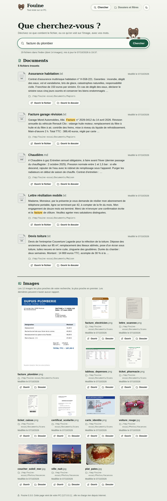
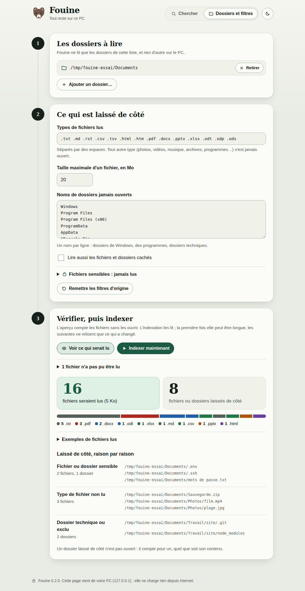
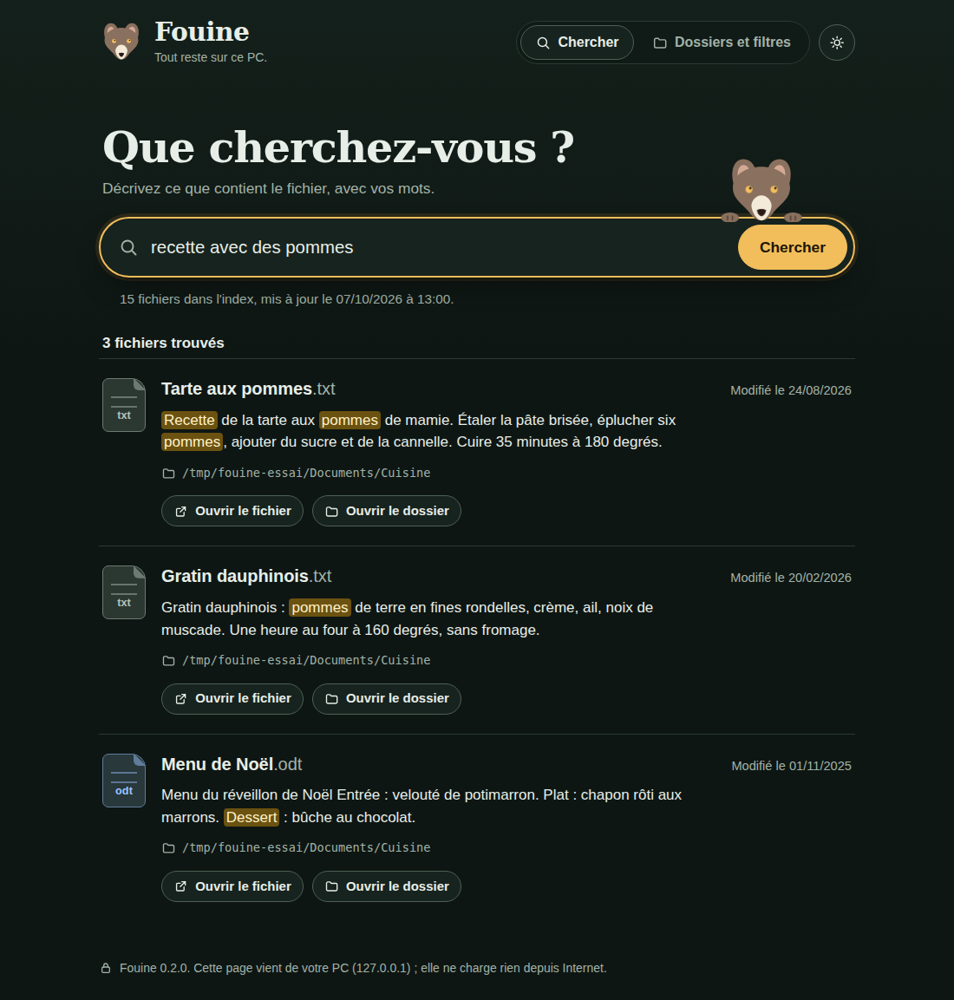

# Fouine

Fouine retrouve vos fichiers **par leur contenu et par leur sens**, sur votre PC.
Vous tapez « combien m'a coûté la réparation de la fuite d'eau » et Fouine vous
montre la facture du plombier, même si aucun de ces mots n'est dans le nom du fichier.

**Tout se passe sur votre PC.** Vos fichiers, leur texte et vos recherches ne
sont envoyés nulle part.

> Petite version (0.4). Elle fait peu de choses, volontairement. Nouveau dans la 0.4 : Fouine est une **vraie application** : un installateur Windows qui pose une **icône sur le Bureau**, et une **fenêtre à lui** (plus de navigateur, plus de fenêtre noire). Depuis la 0.3, il peut aussi chercher dans vos **images** (option à cocher).

## Ce qui reste sur votre PC, et les seules connexions à Internet

- Fouine lit vos fichiers et calcule leur « empreinte de sens » (embedding) **sur votre PC**, avec de petits modèles.
- L'index est un simple fichier rangé sur votre PC (sous Windows : `%LOCALAPPDATA%\Fouine`).
- L'interface s'affiche dans la fenêtre de Fouine. C'est une page qui vient de votre PC (adresse `127.0.0.1`) : elle ne charge rien depuis Internet et n'est pas visible depuis un autre appareil.
- **Fouine se connecte à Internet dans deux cas seulement**, pour télécharger ses modèles depuis le site Hugging Face, une fois chacun :
  1. à la première indexation, le modèle des textes (environ 220 Mo) ;
  2. **seulement si vous cochez « Lire aussi les images »**, le modèle des images (environ 315 Mo), à la première indexation qui suit.

  Ensuite Fouine marche sans connexion. Rien n'est jamais envoyé : ce sont des téléchargements.

## Installation sous Windows : l'installateur (le plus simple)

1. Allez sur la page [« Releases »](https://github.com/RomainC-lab/fouine/releases/latest) et téléchargez le fichier `Fouine-…-installation.exe`.
2. **Double-cliquez dessus.** La première fois, Windows affiche sans doute une fenêtre bleue **« Windows a protégé votre ordinateur »** (SmartScreen). C'est attendu : Fouine n'est pas « signé », parce qu'une signature se paie chaque année. Cliquez sur **« Informations complémentaires »**, puis sur **« Exécuter quand même »**.
3. Suivez les deux ou trois écrans de l'installateur, en français. Il n'a **pas besoin des droits d'administrateur** : Fouine est installé pour vous seul. Laissez cochée la case « Créer un raccourci sur le bureau ».
4. Fouine se lance depuis **l'icône de la fouine sur le Bureau**, ou depuis le menu Démarrer.

Fouine s'ouvre dans **sa propre fenêtre**, comme n'importe quelle application. **Pour l'arrêter, fermez cette fenêtre.** Si une indexation est en cours, Fouine demande confirmation ; ce qui est déjà lu est gardé. Si vous relancez Fouine alors qu'il tourne déjà, c'est la fenêtre ouverte qui revient devant.

Où sont les choses :

| Quoi | Où |
| --- | --- |
| Le programme | `%LOCALAPPDATA%\Programs\Fouine` |
| Vos données : index, réglages, vignettes, modèles téléchargés, journal `fouine.log` | `%LOCALAPPDATA%\Fouine` |

(Tapez ces chemins tels quels dans la barre d'adresse de l'Explorateur.)

**Pour mettre à jour**, fermez Fouine puis lancez l'installateur de la nouvelle version : il remplace l'ancienne, et vos données sont gardées.

**Pour désinstaller** : Paramètres de Windows, « Applications », « Applications installées », Fouine, « Désinstaller ». Le programme et les raccourcis sont retirés. L'installateur demande ensuite s'il doit aussi supprimer vos données (index, réglages, modèles) ; par défaut il les garde. Vos propres fichiers ne sont jamais touchés.

Les modèles ne sont pas dans l'installateur ; Fouine les télécharge au premier besoin (voir plus haut). Pour vérifier un fichier téléchargé, la page de la Release donne son empreinte SHA-256. L'installateur et le zip sont fabriqués par GitHub à partir du code de ce dépôt (voir `.github/workflows/`), pas sur le PC de quelqu'un.

### Si quelque chose ne va pas

- **La fenêtre ne s'ouvre pas** : elle s'appuie sur « WebView2 », le moteur de Microsoft Edge, présent d'origine sur Windows 11. S'il manque, Fouine le dit et s'ouvre dans votre navigateur à la place.
- **Un message d'erreur au démarrage** renvoie au journal : `%LOCALAPPDATA%\Fouine\fouine.log`. Ce fichier ne dépasse pas 1 Mo en tout ; il ne contient ni vos recherches ni le contenu de vos fichiers.
- **Ouvrir Fouine dans le navigateur, comme avant** : lancez `Fouine.exe --navigateur` (par exemple en ajoutant ` --navigateur` à la fin de la « Cible » dans les propriétés du raccourci). Un petit message reste alors affiché : cliquer sur OK arrête Fouine.

## Sans installation : le zip portable (Windows)

1. Sur la page [« Releases »](https://github.com/RomainC-lab/fouine/releases/latest), téléchargez `Fouine-…-windows.zip`.
2. Décompressez-le où vous voulez (clic droit, « Extraire tout… »), par exemple dans `Documents`. Il ne faut pas lancer Fouine depuis l'intérieur du zip.
3. Dans le dossier `Fouine`, **double-cliquez sur `Fouine.exe`** (même alerte SmartScreen que plus haut : « Informations complémentaires », puis « Exécuter quand même »).

C'est le même programme, avec la même fenêtre ; il n'y a simplement ni raccourci ni désinstallation. Le dossier `Fouine` doit rester entier : `Fouine.exe` a besoin du dossier `_internal` qui est à côté de lui. Pour mettre à jour, remplacez le dossier par celui de la nouvelle version ; vos données sont rangées ailleurs (`%LOCALAPPDATA%\Fouine`) et sont gardées.

## Installation avec Python (Windows, Linux, macOS)

Pour qui préfère lancer le code lui-même.

1. **Installer Python** (gratuit), si ce n'est pas déjà fait : allez sur <https://www.python.org/downloads/>, téléchargez Python (version 3.10 ou plus récente), lancez l'installation et **cochez la case « Add python.exe to PATH »** avant de cliquer sur « Install Now ».
2. **Télécharger Fouine** : sur la page du dépôt, bouton vert « Code », puis « Download ZIP ». Décompressez le dossier où vous voulez.
3. Dans le dossier décompressé, **double-cliquez sur `installer.bat`**. Une fenêtre noire travaille quelques minutes (elle télécharge, une fois, les bibliothèques Python nécessaires).
4. **Double-cliquez sur `lancer.bat`**. La fenêtre de Fouine s'ouvre ; une fenêtre noire reste ouverte derrière (c'est Python).

Pour arrêter Fouine, fermez sa fenêtre.

Sous Linux ou macOS : `./installer.sh`, puis `./lancer.sh`. Sous Linux, la fenêtre demande WebKitGTK et PyGObject (paquets `python3-gi` et `gir1.2-webkit2-4.1` sous Debian et Ubuntu, visibles depuis l'environnement Python) ; sans eux, Fouine s'ouvre dans le navigateur, sans rien perdre d'autre. `--navigateur` force ce mode, et `--sans-navigateur` n'ouvre rien : l'adresse de la page est seulement écrite dans le terminal.

## Utilisation

1. Onglet **« Dossiers et filtres »** : choisissez les dossiers que Fouine a le droit de lire. Au premier lancement il propose Documents, Bureau et Téléchargements. Il ne lit jamais tout le disque, sauf si vous le choisissez vous-même.
2. Cliquez sur **« Voir ce qui serait lu »** : Fouine compte les fichiers qui seraient lus et ceux qui seraient laissés de côté, raison par raison, avec des exemples. Rien n'est encore ouvert.
3. Cliquez sur **« Indexer maintenant »**. La première fois, c'est long (téléchargement du modèle, puis lecture de tous les fichiers). Vous pouvez arrêter et reprendre plus tard : ce qui est fait reste fait.
4. Onglet **« Chercher »** : décrivez ce que vous cherchez, avec vos mots. Chaque résultat montre un extrait, l'emplacement, la date, et deux boutons pour ouvrir le fichier ou son dossier.

Quand vos fichiers changent, relancez « Indexer maintenant » : seuls les fichiers nouveaux ou modifiés sont relus, et les fichiers supprimés sortent de l'index. Cette mise à jour n'est pas automatique.

## Chercher aussi dans les images

Dans « Dossiers et filtres », cochez **« Lire aussi les images »** (la case est décochée au départ). Fouine lit alors les photos, les captures d'écran et les documents photographiés des dossiers choisis, et vous les retrouvez en décrivant ce qu'on y voit : « coucher de soleil sur la mer », « facture du plombier », « ticket de la pharmacie ».

- **C'est plus lent** : quelques secondes par image, la première fois seulement (environ 1,5 à 2 secondes sur un vieux PC à 4 cœurs ; 1 000 photos, c'est donc une demi-heure environ). L'aperçu dit combien d'images restent à lire. Il n'annonce une durée que lorsque Fouine a déjà mesuré la vitesse de votre PC ; pendant l'indexation, le temps restant s'affiche après les premières images. Les documents sont lus d'abord, et vous pouvez arrêter puis reprendre.
- **Un second modèle est téléchargé**, une seule fois (environ 315 Mo) : EmbeddingGemma 2, de Google. Si la case reste décochée, il n'est ni téléchargé ni chargé.
- **Les résultats sont en deux blocs** : « Documents », comme avant, et « Images », une planche de vignettes. Les deux blocs ne sont pas mélangés, parce que les deux modèles ne notent pas de la même façon. Fouine montre les 12 images les plus proches, la plus proche en premier ; il n'y a pas de seuil, donc les dernières peuvent n'avoir aucun rapport avec votre recherche.
- **Types lus** : `.jpg` `.jpeg` `.jfif` `.png` `.webp` `.bmp` `.gif` (première image seulement) `.tif` `.tiff`. **Non lus** : les photos `.heic` des iPhone, les fichiers RAW des appareils photo (`.cr2`, `.nef`, `.arw`, `.dng`…), les `.svg`, les `.psd`, et toutes les vidéos.
- **Les mêmes filtres s'appliquent** (fichiers sensibles d'après leur nom, dossiers exclus, fichiers cachés, raccourcis jamais suivis), avec deux réglages en plus : les images de moins de 64 points de côté (icônes, miniatures) et celles de plus de 40 Mo sont laissées de côté. Une image abîmée est comptée parmi les fichiers « pas pu être lus », sans arrêter l'indexation.
- Si vous décochez la case, les images sortent de l'index à l'indexation suivante.

Le thème sombre suit le réglage de votre PC ; le bouton en haut à droite permet d'en changer, et Fouine retient ce choix d'un lancement à l'autre.

## Ce qui est laissé de côté par défaut

| Quoi | Détail |
| --- | --- |
| **Fichiers sensibles** (jamais lus) | `.env`, `*.pem`, `*.key`, `id_rsa*`, `*.kdbx`, `*.pfx`, `*.p12`, portefeuilles (`wallet`), dossiers `.ssh`, `.gnupg`, profils de navigateur (Chrome, Edge, Firefox, Brave…), et tout fichier ou dossier dont le nom contient « password », « mot de passe », « mdp », « secret », « identifiants ». |
| **Dossiers du système** | `Windows`, `Program Files`, `ProgramData`, `AppData`, `$Recycle.Bin`… (et `/proc`, `/sys`, `/etc`… sous Linux). |
| **Dossiers techniques** | `.git`, `node_modules`, `venv`, `__pycache__`, caches. |
| **Fichiers et dossiers cachés** | Ceux dont le nom commence par un point, ou marqués « cachés » sous Windows. |
| **Tout ce qui n'est pas un document** | Seuls ces types sont lus : `.txt` `.md` `.rst` `.csv` `.tsv` `.html` `.htm` `.pdf` `.docx` `.pptx` `.xlsx` `.odt` `.odp` `.ods`. Vidéos, musique, archives, programmes : jamais ouverts. Les images ne sont lues que si vous cochez « Lire aussi les images ». |
| **Images trop petites ou trop grosses** | Moins de 64 points de côté, ou plus de 40 Mo (quand les images sont lues). |
| **Le dossier de Fouine lui-même** | Son index, ses vignettes et ses modèles ne sont jamais lus, même s'ils se trouvent dans un dossier choisi. |
| **Fichiers trop gros** | Plus de 20 Mo. |
| **Raccourcis (liens symboliques)** | Jamais suivis : Fouine ne sort pas des dossiers choisis. |

Un dossier laissé de côté n'est pas ouvert du tout.

Ces réglages se changent dans la page (types de fichiers, taille, noms de dossiers, fichiers cachés) ou dans le fichier `reglages.json` du dossier de données, lisible avec le Bloc-notes. La liste des fichiers sensibles ne se change que dans ce fichier, pour éviter de la vider par erreur.

## Limites connues

- **PDF scannés** : Fouine ne lit pas le texte d'un PDF fait d'images (pas de reconnaissance de caractères). Un PDF scanné reste trouvable par son nom seulement.
- **Images** : le modèle « regarde » l'image entière, réduite. Il reconnaît bien le sujet d'une photo et le genre d'un document photographié (facture, ticket, lettre) avec ses gros titres ; il ne lit pas de façon fiable les petits caractères d'une page entière. Sur le jeu d'essai (11 questions sur des photos, 16 sur des images de documents, 25 images), la bonne image arrivait en tête à chaque fois ; ce jeu est petit et fabriqué, vos résultats seront moins nets, surtout parmi des milliers de photos qui se ressemblent.
- **Images, suite** : pas de recherche par visage ou par nom de personne, pas de lecture des `.heic`, des RAW ni des vidéos. Le nom du fichier d'une image ne compte pas dans la recherche.
- **Mémoire** : avec les images, Fouine utilise environ 1,2 Go de mémoire pendant l'indexation et la recherche (environ 700 Mo sans les images).
- **Tableurs** : seul le texte des cellules est lu, pas les nombres ; la recherche par le sens y marche moins bien.
- **Anciens formats** `.doc`, `.xls`, `.ppt` : non lus.
- Les filtres sur les noms sont volontairement prudents : un fichier appelé `secretariat.txt` est écarté parce que son nom contient « secret ». L'aperçu le montre.
- Un texte très long est coupé après environ 400 pages.
- Les résultats peuvent contenir, en fin de liste, des fichiers sans grand rapport : le modèle est petit.
- Pensé pour quelques milliers à quelques dizaines de milliers de documents. Au-delà, la recherche ralentit et prend plus de mémoire.
- L'index contient le texte de vos documents, en clair, sur votre PC : il est aussi privé qu'eux. Quand les images sont lues, le dossier de données contient aussi une petite copie de chaque image (les vignettes).
- **Sous Windows**, tout est essayé sur les machines de GitHub avant publication : les tests automatiques, l'auto-test de `Fouine.exe`, l'ouverture réelle de la fenêtre, puis l'installateur (installation, raccourcis, désinstallation). Ce que ces essais ne montrent pas : l'allure de la fenêtre sur votre écran, le téléchargement des modèles et la vitesse sur un vrai PC ; cela reste à confirmer par l'usage. Un antivirus peut aussi se méfier d'un programme non signé.
- **La fenêtre** n'a pas de menu : pas de clic droit « Copier » (Ctrl+C marche), et sa taille n'est pas retenue d'une fois sur l'autre.

## Pour tout effacer

Désinstallez Fouine (voir plus haut) en répondant « Oui » à la question sur les données ; ou, avec le zip portable, supprimez le dossier de `Fouine.exe`. Le dossier de données (index, réglages, vignettes, modèles, journal) est `%LOCALAPPDATA%\Fouine` sous Windows (tapez ce chemin dans la barre d'adresse de l'Explorateur), `~/.local/share/fouine` sous Linux, `~/Library/Application Support/Fouine` sous macOS : le supprimer efface tout ce que Fouine a retenu. Vos fichiers ne sont jamais modifiés par Fouine.

## Pour les curieux

- Python, peu de dépendances : [fastembed](https://github.com/qdrant/fastembed) (calcul des embeddings avec ONNX, sans PyTorch), `numpy`, `pypdf`. Les documents Office et LibreOffice sont lus avec la bibliothèque standard. Les images n'ajoutent aucune bibliothèque : `onnxruntime`, `tokenizers`, `huggingface_hub` et `pillow` viennent déjà avec fastembed.
- Modèle des textes : `sentence-transformers/paraphrase-multilingual-MiniLM-L12-v2` (multilingue, 384 dimensions).
- Modèle des images : [`onnx-community/embeddinggemma-2-ONNX`](https://huggingface.co/onnx-community/embeddinggemma-2-ONNX) (EmbeddingGemma 2 de Google, licence Apache 2.0), variante `q4`, 70 jetons par image, vecteurs raccourcis à 256 dimensions, version du dépôt fixée dans le code. La question est encodée par les deux modèles ; le second n'est chargé que si des images sont dans l'index.
- Vignettes : fabriquées sur le PC avec Pillow, servies seulement pour une image présente dans l'index, avec le même jeton que le reste.
- Fenêtre : [pywebview](https://pywebview.flowrl.com/), qui affiche la page du serveur local dans WebView2 (Windows), WebKitGTK (Linux) ou WebKit (macOS). Aucune fonction Python n'est offerte à la page (pas de `js_api`) : elle ne parle à Fouine que par le serveur local, avec le jeton. Téléchargements et adresses `file://` y sont coupés ; les outils de développement aussi.
- Une seule instance par dossier de données : un verrou sur `fouine.verrou`. Un second lancement demande au premier de ramener sa fenêtre devant, avec une clé à part (fichier `instance.json`) qui ne permet rien d'autre.
- `Fouine.exe` : PyInstaller, en mode dossier et sans console, fabriqué par GitHub Actions ; l'installateur est fait avec [Inno Setup](https://jrsoftware.org/isinfo.php) (`emballage/Fouine.iss`). Avant publication, sur une machine Windows de GitHub : `Fouine.exe --version`, `Fouine.exe --autotest` (auto-test sans réseau, dans un dossier provisoire), ouverture de la vraie fenêtre (option `--essai-fenetre`, réservée à cet usage), puis installation silencieuse, vérification des raccourcis et désinstallation. Recette : `emballage/Fouine.spec`.
- Index : un fichier SQLite ; le texte est découpé en morceaux qui se chevauchent ; la recherche mélange la ressemblance de sens (cosinus) et la recherche par mots (FTS5).
- Serveur local : écoute sur `127.0.0.1` uniquement, port libre choisi au lancement, vérifie les en-têtes `Host` et `Origin`, demande un jeton secret tiré au hasard à chaque lancement ; « ouvrir le fichier » n'accepte qu'un fichier présent dans l'index. La page interdit tout script qui ne vient pas d'elle (`Content-Security-Policy`), y compris dans la fenêtre.
- Tests : `python -m unittest discover -s tests -t .` (faux modèles, rien n'est téléchargé). Essai réel avec les vrais modèles, à la main : `python tests/essai_reel.py`.

## Licence

MIT — voir [LICENSE](LICENSE).
